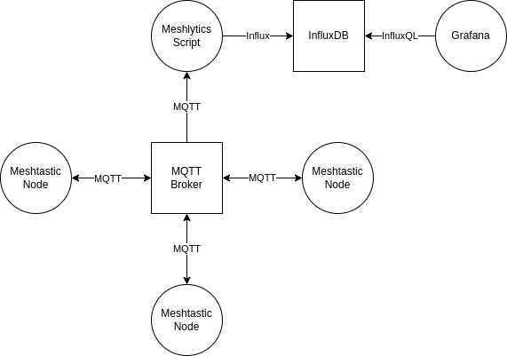
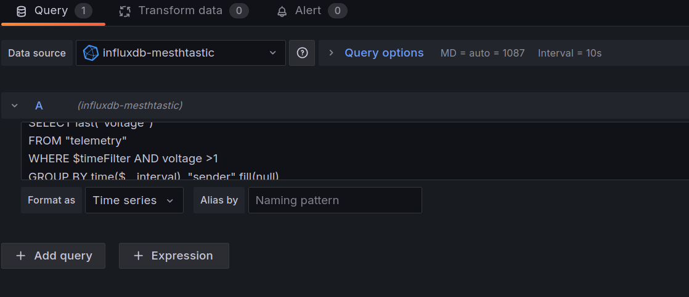

## What is this thing?

This is a shabby Python script that gatters data from the Meshtastic MQTT and puts them into an InfluxDB for further analysis.  Common datafields (SNR, hops_away, etc.) are also getting merged into a unified database to increase data density.

## Architecture Sketch 



## How to get this thing running?


1. Install required packages

`# pip install -r requirements.txt`

2. Adjust the MQTT and InfluxDB login data

```
    config = MeshlyticsConfig(
        mqtt_broker="dummy_broker.com",
        mqtt_port=1883,
        mqtt_user="dummy_pw",
        mqtt_password="dummy_pw",
        mqtt_topic="msh/EU_868/2/json/LongFast/#",
        influxdb_host="dummy_influx.com",
        influxdb_port=8086,
        influxdb_user="dummx_user",
        influxdb_password="dummy_pw",
        influxdb_database="meshtastic"
    )
```

3. Start it 

```
# python3 meshlytics.py
```

## Note

A lot of data (telemetry) of Meshtastic nodes in "Router"-mode are only getting transmitted twice a day! If you want to monitor/optimize the battery level you maybe have to increase this in the defaults.h or set it manually using the Python interface. You maybe can even do this by using the  remote administration infrastructure.

Warning: **Only increase the telemetry broadcast rate during the tuning and opimization phase! Telemetry packets are big and eat a lot of air time!**

## Grafana

If you want to visualize *all* received nodes dynamically you can use following snipped which can be modified and recycled for all logged data (hops_away, temperature etc.).

```
SELECT last("voltage") 
FROM "telemetry" 
WHERE $timeFilter AND voltage >1
GROUP BY time($__interval)
```





You can find the importable Grafana dashboard from the screenshot above [here](./doc/meshtastic-grafana-dashboard.json).

## Known bugs?

Most of the telemetry payloads haven't been tested yet. I expect some trouble from this as the value representation within MQTT jumps between integer and float (5.1 -> 5 -> 4.9).