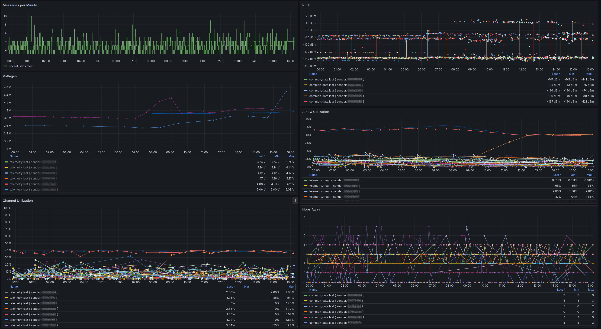

## What is this thing?

This is a shabby Python script that gatters data from the Meshtastic MQTT and puts them into an InfluxDB for further analysis. 

Common datafields (SNR, hops_away, etc.) are also getting merged into a single database.

## How to get this thing running?

1. Install required packages

`#include -r requirements.txt`

2. Adjust the MQTT and InfluxDB login data

```
if __name__ == "__main__":
    config = MeshlyticsConfig(
        mqtt_broker="dummy_broker",
        mqtt_port=1883,
        mqtt_user="dummyUser",
        mqtt_password="dummyPassword",
        mqtt_topic="dummy/topic/#",
        influxdb_host="dummy_host",
        influxdb_port=8086,
        influxdb_user="dummyInfluxUser",
        influxdb_password="dummyInfluxPassword",
        influxdb_database="dummy_database"
    ) 
```

3. Start it 

```
# python3 meshlytics.py
```

# Known bugs?

Most of the telemetry payloads haven't been tested yet. I expect some trouble from this as the value representation within MQTT jumps between integer (5.1 -> 5 -> 4.9). But most stuff seems to work for now.