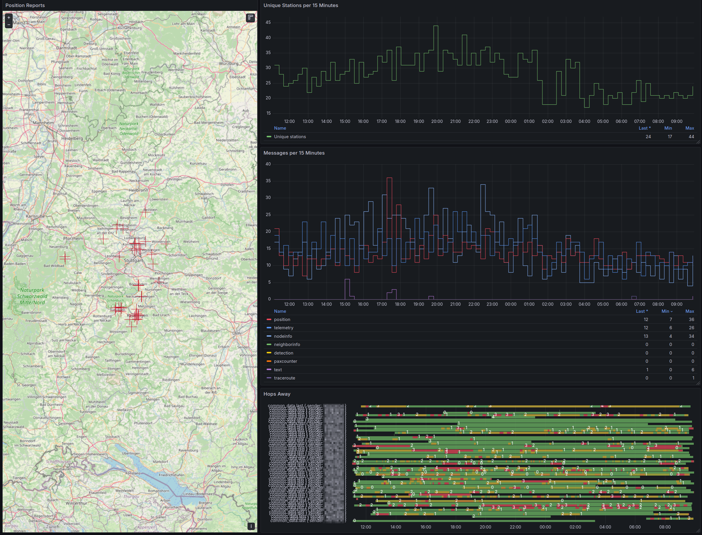
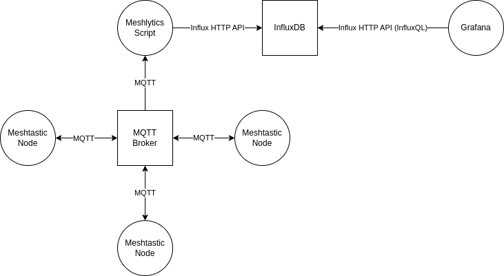

## What is this thing?

This is a shabby Python script that gatters data from the Meshtastic MQTT and puts them into an InfluxDB for further analysis. 

Common datafields (SNR, hops_away, etc.) are also getting merged into a unified database.


## Architecture Sketch 



## How to get this thing running?


1. Install required packages

`# pip install -r requirements.txt`

2. Adjust the MQTT and InfluxDB login data

```
    config = MeshlyticsConfig(
        mqtt_broker="dummy_broker.com",
        mqtt_port=1883,
        mqtt_user="dummy_pw",
        mqtt_password="dummy_pw",
        mqtt_topic="msh/EU_868/2/json/LongFast/#",
        influxdb_host="dummy_influx.com",
        influxdb_port=8086,
        influxdb_user="dummx_user",
        influxdb_password="dummy_pw",
        influxdb_database="meshtastic"
    )
```

3. Start it 

```
# python3 meshlytics.py
```

## Grafana

If you want to visualize *all* data dynamically you can use following snipped which can be modified and recycled for all logged data (hops_away, temperature etc.).

```
SELECT last("voltage") 
FROM "telemetry" 
WHERE $timeFilter AND voltage >1
GROUP BY time($__interval)
```

## Known bugs?

Most of the telemetry payloads haven't been tested yet. I expect some trouble from this as the value representation within MQTT jumps between integer (5.1 -> 5 -> 4.9). But most stuff seems to work for now.
